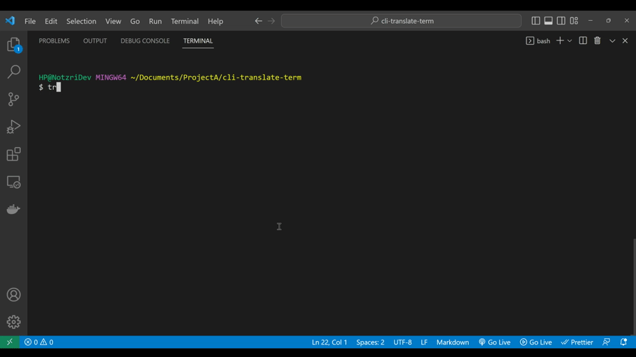

  # CLI-Translate-term v1.0.0
 <p align="center">
   
 
   
   
  
 </p>
 <br>
<p align="center">A simple CLI to translate to any specific language in the terminal.</p>
<br>

<p align="center">

</p>


---

## Usage

```
~$ tran --help
Usage: tran <lang_name> <sentence to be translated>

Options:
        --version             Show version number.              [boolean]
    -l, --languages           List all languages.               [boolean]
        --help                Show help.                        [boolean]

```

> :warning: **You can also use the [ISO-639-1](https://en.wikipedia.org/wiki/List_of_ISO_639-1_codes) code of the language instead of writing the full language name**

<br>

## Installation

1. Clone the repository and then navigate to it.
2. Run ```npm install``` to install the dependencies.
3. Run ```npm install -g .``` to install the CLI. <br>

4. Now you are good to go and can use the CLI globally!

Type ```tran``` or ```tran --help``` to get started.

<br>

## License

MIT ©***cli-translate-term***
